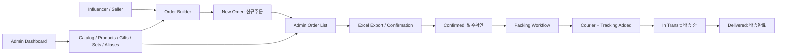
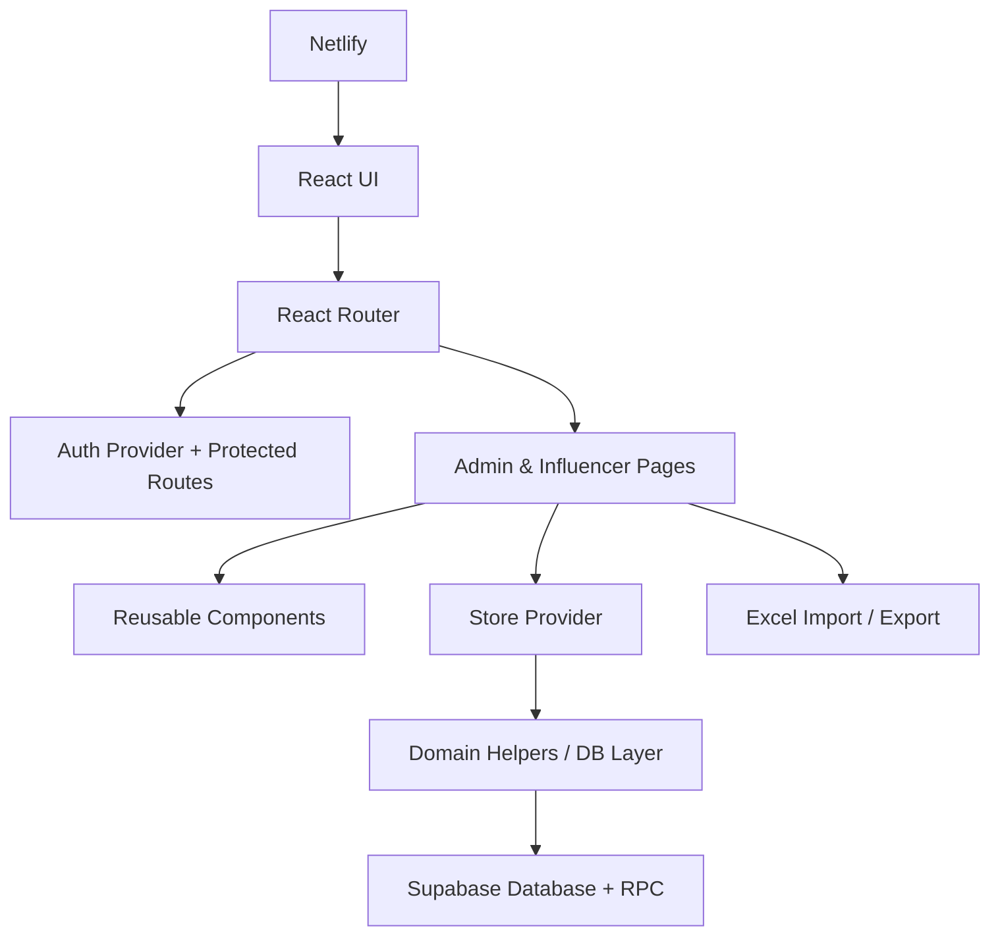

# Live Commerce Logistics

<div align="center">

## A role-based operations platform for live-commerce order management, catalog control, Excel workflows, and fulfillment tracking.

**Built to transform messy influencer sales, spreadsheet orders, product aliases, bundle inventory, and delivery updates into one structured operating system.**

<br />


<br />

**Admin Dashboard** · **Influencer Order Builder** · **Excel Import/Export** · **Catalog Management** · **Order Lifecycle Tracking** · **Supabase Persistence**

</div>

---

## Executive Overview

**Live Commerce Logistics** is a full-stack web application designed for teams running live-commerce and influencer-driven sales operations.

In live commerce, orders often come from different sellers, influencers, product nicknames, Excel sheets, set products, free gifts, and changing delivery statuses. Without a structured system, the workflow becomes difficult to control: product names are inconsistent, inventory is hard to verify, exports are manual, and order status is unclear.

This project solves that problem by centralizing the operational flow into a clean, role-based platform where:

- **Influencers** can create and submit customer orders.
- **Admins** can manage products, catalogs, gifts, aliases, set products, and fulfillment status.
- **Operations teams** can import, review, export, pack, ship, and complete orders using a controlled workflow.
- **Data** is designed to persist through Supabase instead of temporary browser storage.

The result is a professional operations dashboard that combines product management, sales workflow control, spreadsheet handling, and delivery tracking in one system.

---

## Project Snapshot

| Category | Details |
|---|---|
| Project Type | Live-commerce operations and logistics management system |
| Primary Users | Admins, influencers, fulfillment operators, sales teams |
| Frontend | React 19, Vite, React Router DOM |
| Backend / Database | Supabase |
| Data Workflows | Excel import/export, JSON backup/import, catalog normalization |
| Deployment Target | Netlify |
| Main Focus | Order lifecycle control, catalog accuracy, fulfillment visibility |
| Engineering Style | Role-based routing, modular UI components, Supabase-first persistence |

---

## The Problem This Project Solves

Live-commerce operations are fast, messy, and highly manual. A single campaign can involve:

- Multiple influencers or sellers
- Product nicknames that do not match official SKUs
- Event products and changing prices
- Bundle/set products with component stock
- Free gifts and limited campaign inventory
- Excel-based order submissions
- Manual packing and courier tracking updates
- Admin confirmation before fulfillment

**Live Commerce Logistics** was built to bring those disconnected workflows into a single operating system.

---

## Core Capabilities

### 1. Admin Operations Dashboard

The admin dashboard is the control center for live-commerce operations.

Admins can manage:

- Main products
- Master catalog products
- Event/live-sale products
- Product aliases
- Set products
- Set components
- Gifts and campaign inventory
- Brand/product metadata
- Product pricing and stock fields

Operational improvements include:

- Searchable product records
- Pagination for long catalog lists
- Editable product image fields
- Bulk-select and delete workflows
- Cleaner dashboard layout for professional admin use
- Centralized visibility into product and order data

---

### 2. Influencer Order Builder

Influencers can create customer orders through a guided order-building workflow instead of relying only on spreadsheets or chat messages.

Key capabilities:

- Create customer orders
- Add products, sets, and gifts
- Select catalog-based items
- Validate important order fields
- Submit orders into the admin workflow
- Support Excel-style order creation and review

This separates influencer-facing order creation from admin-facing fulfillment management, making the system easier to scale.

---

### 3. Admin Order List and Fulfillment Control

The admin order list is designed for fulfillment teams that need to quickly understand what has been ordered, confirmed, exported, shipped, or completed.

Admins can:

- View seller/influencer-grouped orders
- Search by seller, customer, nickname, product, phone number, or address
- Filter by status and date type
- Export selected or visible orders
- Mark exported orders as confirmed
- Add courier and tracking number details
- Move orders into shipping status
- Mark orders as delivered
- Reopen delivery-completed orders when correction is needed
- Open packing workflows for selected orders

---

### 4. Order Lifecycle Management

The platform uses a clear order lifecycle so operations teams can understand the exact stage of every order.

| Status | Korean Label | Operational Meaning |
|---|---|---|
| New | 신규주문 | Order has been submitted but not yet exported or confirmed by admin |
| Confirmed | 발주확인 | Admin has downloaded/exported the order for processing |
| In Transit | 배송 중 | Courier/tracking information has been added |
| Delivered | 배송완료 | Admin has marked the order as completed |

This lifecycle makes fulfillment auditable and reduces confusion between newly submitted orders and orders already processed by admins.

---

### 5. Catalog, Alias, Set Product, and Gift Management

Live-commerce teams often receive product names in inconsistent formats. This system is designed to normalize that messy input into official catalog records.

Supported catalog workflows:

- Official SKU and product-code management
- Product alias mapping
- Brand management
- Live-event product pricing
- Set product definitions
- Set component tracking
- Gift inventory management
- Component-based set stock calculation

This helps prevent fulfillment mistakes caused by inconsistent product names or campaign-specific naming.

---

### 6. Excel Import and Export Workflows

Because live-commerce teams often work with Excel, the system includes spreadsheet-oriented workflows.

Supported workflows:

- Import catalog/order data from Excel
- Review imported Excel orders before confirmation
- Export order lists for fulfillment processing
- Download order templates
- Import/export JSON backup data for migration or recovery

The goal is not to replace Excel completely, but to make Excel part of a controlled operational system.

---

## System Workflow



---

## Architecture Overview



---

## Engineering Highlights

This repository is presented as a professional engineering project, not just a UI demo.

### Product Engineering

- Designed around a real business workflow: influencer sales, catalog control, order confirmation, packing, shipping, and delivery completion.
- Uses separate admin and influencer experiences instead of one generic page for all users.
- Defines a clear order lifecycle with operationally meaningful statuses.
- Supports messy real-world product data through aliases, sets, gifts, and event products.

### Frontend Engineering

- Built with React and Vite for a modern frontend development workflow.
- Uses React Router for multi-page application structure.
- Organizes the app into pages, reusable components, layout, auth, data, and library domains.
- Includes premium UI files for dashboard, order list, and order builder screens.
- Uses reusable UI pieces such as metric cards, status badges, tabs, sidebars, topbars, and editable tables.

### Data and Operations Engineering

- Supabase-first design for persistent operational data.
- Local browser storage is intentionally disabled for core app state to avoid unreliable temporary persistence.
- Supports spreadsheet workflows through the `xlsx` library.
- Includes catalog and inventory helper logic for operational consistency.
- Uses UUID/random ID generation for record identity handling.

### Deployment Readiness

- Includes Netlify configuration for production build and deployment.
- Defines Node 20 in the project engine configuration.
- Provides standard development, build, lint, and preview scripts.
- Uses environment variables for Supabase configuration.

---

## Tech Stack

| Layer | Technology |
|---|---|
| Frontend Framework | React 19 |
| Build Tool | Vite 5 |
| Routing | React Router DOM 7 |
| Backend / Database | Supabase |
| Spreadsheet Processing | xlsx |
| ID Generation | uuid / crypto.randomUUID fallback |
| Deployment | Netlify |
| Code Quality | ESLint |
| Language | JavaScript ES Modules |

---

## Project Structure

```txt
live-commerce-logistics/
├── docs/                         # Project documentation and notes
├── public/                       # Public assets
├── src/
│   ├── assets/                   # Static frontend assets
│   ├── auth/                     # Auth provider and protected route logic
│   ├── components/               # Reusable UI components
│   │   ├── EditableTable.jsx
│   │   ├── ExcelOrderImport.jsx
│   │   ├── MetricCard.jsx
│   │   ├── OrdersEditableTable.jsx
│   │   ├── PageHeader.jsx
│   │   ├── Sidebar.jsx
│   │   ├── StatusBadge.jsx
│   │   ├── Tabs.jsx
│   │   └── Topbar.jsx
│   ├── data/                     # Initial state and store provider
│   ├── layout/                   # Application shell layout
│   ├── lib/                      # Supabase, database, catalog, inventory, and IO helpers
│   ├── pages/                    # Main application pages
│   │   ├── AdminLogin.jsx
│   │   ├── Dashboard.jsx
│   │   ├── ExcelOrderReview.jsx
│   │   ├── InfluencerLogin.jsx
│   │   ├── Influencers.jsx
│   │   ├── Landing.jsx
│   │   ├── OrderList.jsx
│   │   ├── Orders.jsx
│   │   └── Packing.jsx
│   ├── App.jsx                   # Route configuration
│   ├── main.jsx                  # React entry point
│   └── styles.css                # Global styles
├── index.html
├── netlify.toml
├── package.json
└── vite.config.js
```

---

## Main Application Areas

| Area | File | Purpose |
|---|---|---|
| Landing | `Landing.jsx` | Entry point for choosing the right workflow |
| Admin Login | `AdminLogin.jsx` | Admin authentication screen |
| Influencer Login | `InfluencerLogin.jsx` | Influencer authentication screen |
| Admin Dashboard | `Dashboard.jsx` | Product, catalog, gift, alias, and set management |
| Order Builder | `Orders.jsx` | Order creation workflow for influencer/admin use |
| Order Management | `OrderList.jsx` | Admin order review, export, tracking, and fulfillment |
| Packing | `Packing.jsx` | Packing workflow for selected orders |
| Excel Review | `ExcelOrderReview.jsx` | Review imported Excel orders before saving |
| Influencer Management | `Influencers.jsx` | Influencer/account management area |

---

## Supabase Data Model

The application is designed around a Supabase-backed operational data model.

### Core Tables

| Table | Purpose |
|---|---|
| `brands` | Brand code and brand name management |
| `products` | Master catalog products |
| `event_products` | Campaign/live-event products |
| `gifts` | Gift inventory |
| `alias_mapping` | Seller alias-to-SKU mapping |
| `main_products` | Main product and pricing table |
| `set_products` | Bundle/set product definitions |
| `set_components` | Products inside each set |
| `orders` | Customer order headers |
| `order_items` | Customer order line items |

### Auth RPC Functions

| Function | Purpose |
|---|---|
| `app_login` | Validates admin/influencer login credentials |
| `app_logout` | Ends a stored app session |

---

## Getting Started

### 1. Clone the Repository

```bash
git clone https://github.com/nubee97/live-commerce-logistics.git
cd live-commerce-logistics/live-commerce-logistics
```

> The application code is inside the nested `live-commerce-logistics/` directory.

### 2. Install Dependencies

```bash
npm install
```

### 3. Configure Environment Variables

Create a `.env` file in the project root:

```env
VITE_SUPABASE_URL=your_supabase_project_url
VITE_SUPABASE_PUBLISHABLE_DEFAULT_KEY=your_supabase_publishable_key
```

Alternative supported key name:

```env
VITE_SUPABASE_ANON_KEY=your_supabase_anon_key
```

> Never commit real production keys. Use `.env.example` for safe shared configuration.

### 4. Run the Development Server

```bash
npm run dev
```

### 5. Build for Production

```bash
npm run build
```

### 6. Preview the Production Build

```bash
npm run preview
```

---

## Available Scripts

| Command | Purpose |
|---|---|
| `npm run dev` | Start the local Vite development server |
| `npm run build` | Build the application for production |
| `npm run lint` | Run ESLint checks |
| `npm run preview` | Preview the production build locally |

---

## Deployment

The project includes Netlify configuration:

```toml
[build]
  command = "npm run build"
  publish = "dist"
```

Recommended Netlify settings:

| Setting | Value |
|---|---|
| Base directory | `live-commerce-logistics` |
| Build command | `npm run build` |
| Publish directory | `dist` |
| Node version | `20` |

Before deployment, add the required Supabase environment variables in Netlify.

---

## Screenshots

Add screenshots or GIFs here to make the repository immediately impressive to recruiters, collaborators, and potential clients.

Recommended screenshots:

```md


```

Recommended folder:

```txt
docs/screenshots/
```

---

## Professional Roadmap

Planned improvements that would make the project more production-ready:

- Add `.env.example` and remove any real `.env` file from version control.
- Add Supabase SQL migrations for reproducible database setup.
- Add automated tests for order lifecycle transitions, catalog matching, and set-stock calculations.
- Add GitHub Actions for lint/build checks on pull requests.
- Split larger page files into smaller feature-level components.
- Move more business logic into dedicated hooks and service files.
- Add role/permission management for admins and influencers.
- Add audit logs for order export, tracking updates, and delivery completion.
- Add CSV/XLSX templates for standardized order import.
- Add a formal license file before allowing public reuse.

---

## What This Project Demonstrates

This project demonstrates the ability to:

- Understand a real operational business problem.
- Design a role-based workflow for different user types.
- Build a modern React application with routing and reusable UI components.
- Connect frontend workflows to a backend persistence layer.
- Handle messy real-world data through aliases, product mapping, and spreadsheet workflows.
- Translate business operations into structured software systems.
- Think beyond UI by considering fulfillment, inventory, order lifecycle, and deployment.

---

## Repository Polish Checklist

To make the GitHub page look even more professional, add the following to the repository page:

**Repository description**

```txt
Role-based live-commerce operations platform for influencer orders, catalog management, Excel workflows, and fulfillment tracking.
```

**Suggested GitHub topics**

```txt
react, vite, supabase, netlify, live-commerce, logistics, order-management, inventory-management, dashboard, excel-import, fulfillment, ecommerce
```

**Recommended pinned project title**

```txt
Live Commerce Logistics — React + Supabase Operations Dashboard
```

---

## Author

**Pascal Nnubia**  
AI / Computer Vision Researcher · Full-Stack Builder · Operations Systems Designer

- GitHub: [nubee97](https://github.com/nubee97)
- LinkedIn: [Pascal Nnamdi Nnubia](https://www.linkedin.com/in/pascal-nnamdi-nnubia-1413a0334)

---

## License

This project currently does not include a license file. Add a license before allowing public reuse.
